<h1 flex items-center gap-3>
  <span text-3xl>💻</span>
  <span bg-gradient-to-r from-green-400 to-teal-400 bg-clip-text text-transparent>公司电脑安装使用ClaudeCode教程</span>
</h1>


## 1. 电脑中的Software Center 搜索安装 Vmware

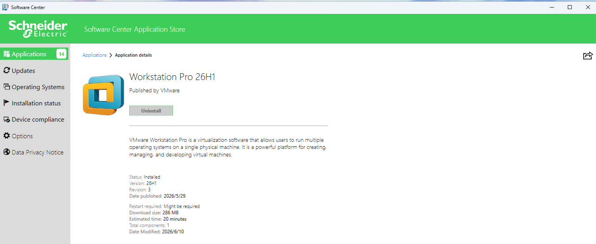

> 如果软件中心没有，请oneDrive中共享的安装包,安装时候会出现管理员账户和密码，咨询2929即可
    
## 2. 下载 Linux ISO 镜像

* 推荐 Omarchy (ArchLinux)  [官网链接https://omarchy.org/](https://omarchy.org/)

* 可以点击ISO自行下载，已共享在oneDrive文档中
* 也可以使用其他熟悉的操作系统（Unbantu）

## 3. Vmware 中选择 ISO 安装

  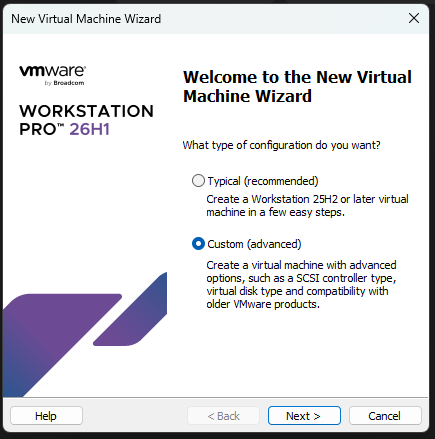
  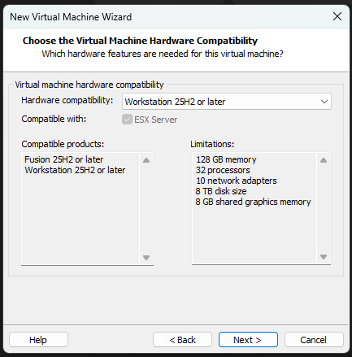
  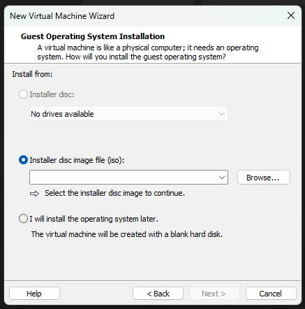

    选择第2步下载的镜像ISO文件

  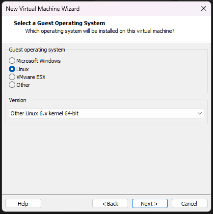


  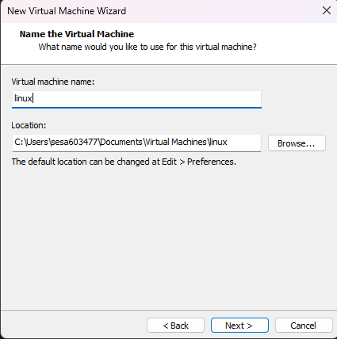

   自定义一个虚拟机名称，这里以[linux]为例
   
  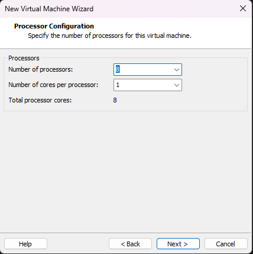

  这里选择虚拟机处理器个数，依据自己电脑的配置选择即可，一般建议配置为最大选项的一半，如有16的选项，那就选择8即可。 第二个项目选择1即可

  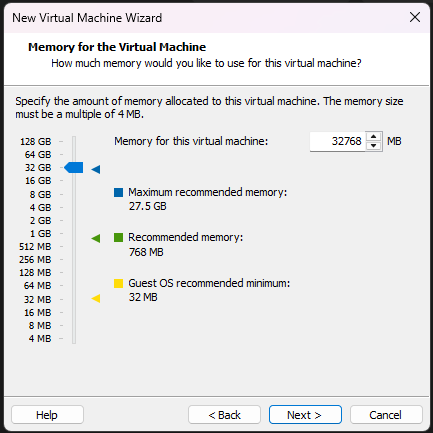

  这里选择虚拟机内存的大小，同样依据个人电脑配置，但不要小于8G
    
  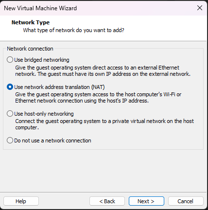

  这里是配置虚拟机的网络类型，必须选择NAT模式，这样就可以使用宿主机的网络访问互联网

  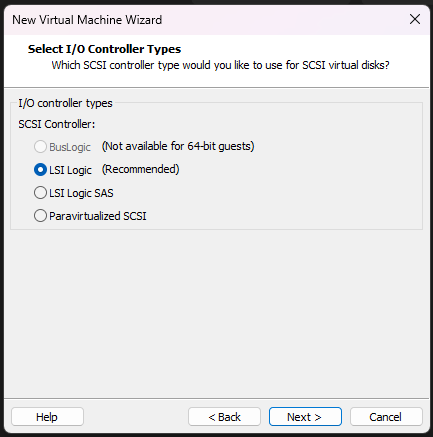
  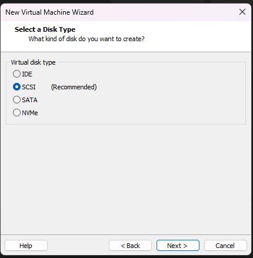
  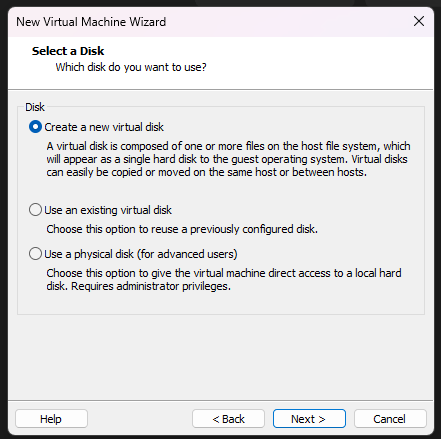
  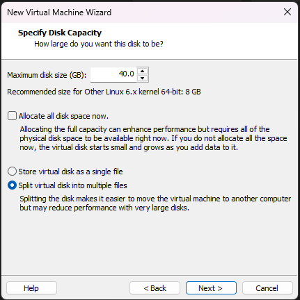

   这里是配置虚拟机的硬盘大小，建议不小于40G
  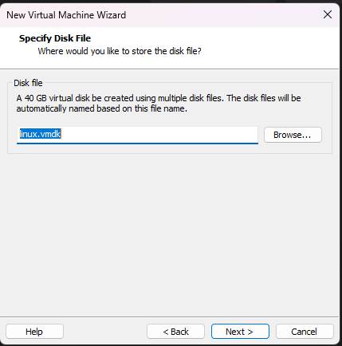

   这里是选择虚拟机文件存放位置和名称，可以自行定义

  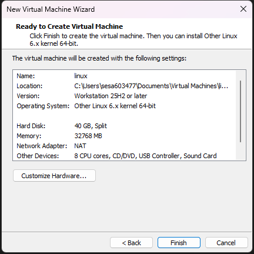

  完成配置，点击Finsh以后即可看到虚拟机已经创建。
  
  下一步点击下图中的`Power On this Virtual machine`

 
  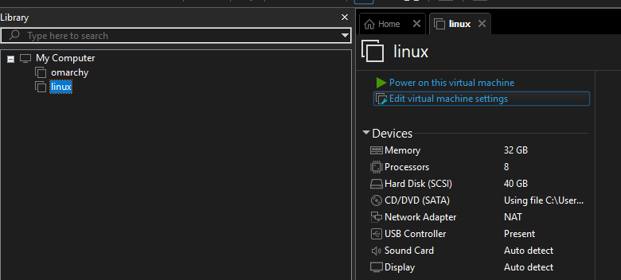

  等待启动以后就可进行linux系统的安装了！

  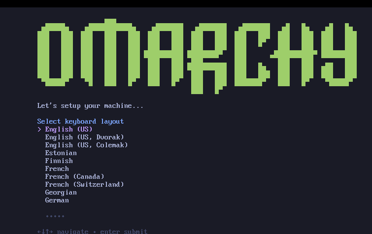

  这里配置键盘布局，默认第一个选项，按`Enter`回车下一步

  
  配置虚拟机的用户名称

  
  配置虚拟机的密码，重复两次确认

  
  配置虚拟机的全名，不重要，随便输入

  
  配置邮箱地址，使用公司邮箱或者个人邮箱都可以


  
  配置域名，自定义这里输入core为例


  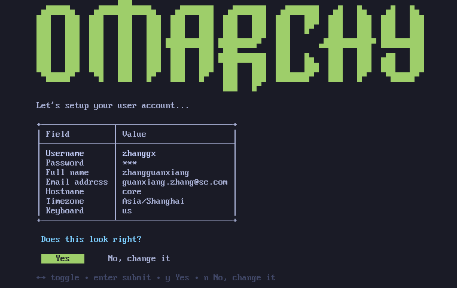
  检查配置，确认无误后回车后进行安装

  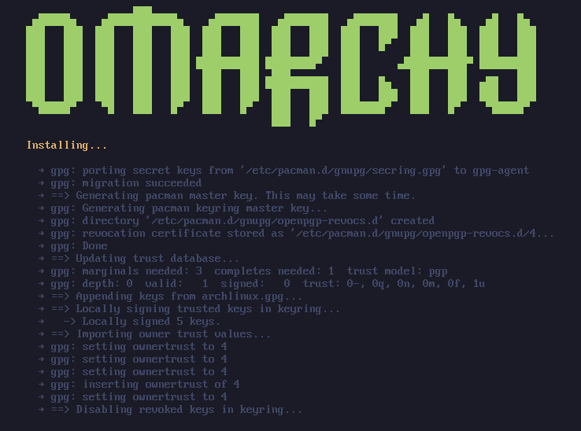

  
  耐心等待，大约5min即可完成linux系统安装，回车就行重新启动。


  ## 4. 基本操作命令

  * omarchy的基本操作
    * Super + Enter 打开命令行终端
    * Super + Space 打开软件中心，快速搜索软件，回车打开
    * Super + Alt + Space 打开系统配置快捷菜单
    * Super + 1/2/3/...9 快速切换桌面
  
  * linux命令
    * ls 查看文件
    * cd 切换路径
  

  ## 5. 安装软件

  * node
  
    * Super + Alt + Sapce -> 输入‘Install’ --> 输入package --> 输入 --> Development --> 输入javaScript --> 输入Node.js --> 回车安装

  * vscode
  * git
  * Claude Code

  <div border="~ gray-700" rounded-xl p-5>
  <div text-lg font-bold mb-3><span text-green-400>1. 安装 Node.js</span></div>
  <div text-sm opacity-75>去 https://nodejs.org 下载 LTS 版本，一路下一步</div>
</div>

<div border="~ gray-700" rounded-xl p-5 mt-3>
  <div text-lg font-bold mb-3><span text-green-400>2. 打开终端</span></div>
  <div text-sm opacity-75>Windows: Win+R → cmd → 回车<br/>Mac: Launchpad → 终端</div>
</div>

::right::

<div border="~ gray-700" rounded-xl p-5 mt-6>
  <div text-lg font-bold mb-3><span text-green-400>3. 安装 Claude Code</span></div>

```bash
npm install -g
  @anthropic-ai/claude-code
```
</div>

<div border="~ gray-700" rounded-xl p-5 mt-3>
  <div text-lg font-bold mb-3><span text-green-400>4. 启动</span></div>

```bash
claude
```
  <div text-sm opacity-75 mt-2>然后就可以对话了</div>
</div>

  * CC Switch

## 6. 使用注意事项

* 公司VPN开启时，需要开启防火墙，关闭VPN时，则不需要
* 购买Deepseek
